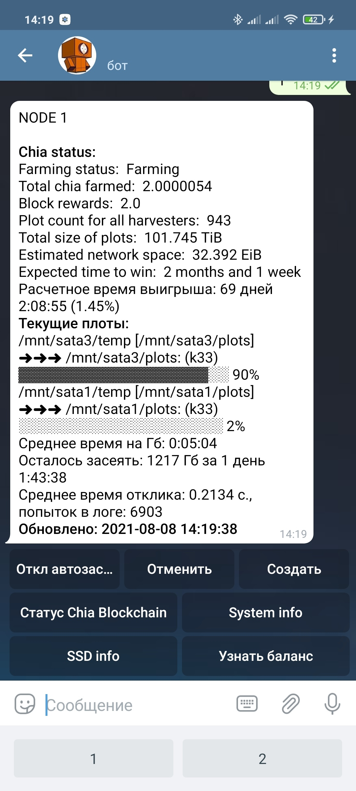
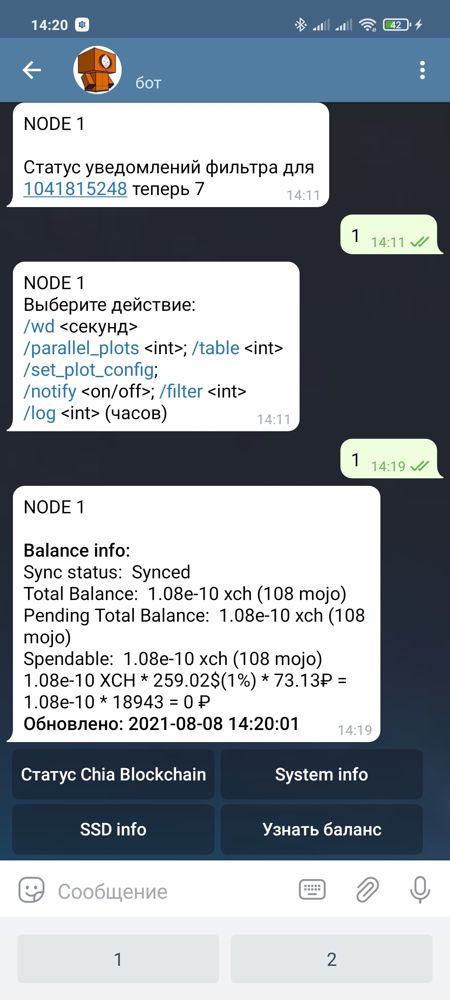
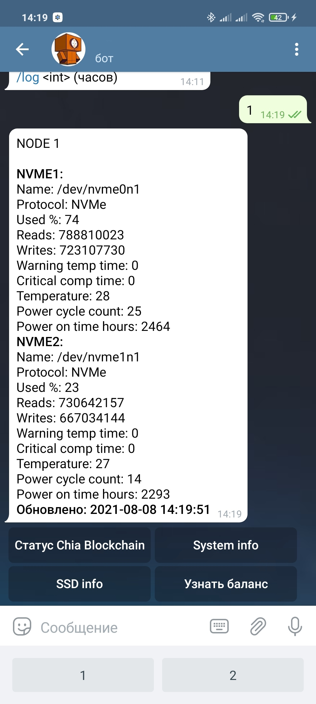
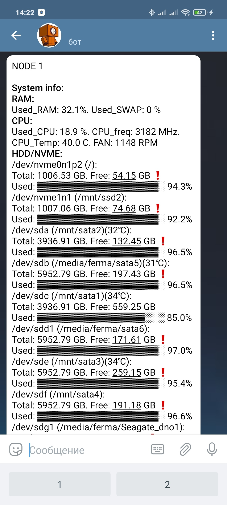

# Chia telegram bot

Помогает управлять фермой с несколькими харвестерами через телеграмм. На данный момент потдерживает только Linux, тестировался в Ubuntu 20.04 и 21.04. Представляет из себя 3 скрипта chia_bot.py, plot_move.py, plots_creator.py.

 

 
## Возможности

**Управление фермой:**

- Отображение текущего статуса фарминга (эквивалент команды chia farm summary)
- Отображение баланса вашего кошелька
- Отображение прогресса плоттинга
- Возможность отменить создание плота(с удалением всех временных файлов и закрытием процесса чиа)
- Возможность вручную создать плот(с выбором размера плота, и каталогов)
- **Автоматическое создание плотов.** Бот сам находит свободные диски на вашей ферме и сеет на них, используя либо указанные в конфиге пути к NVME/SSD либо используя SATA диски (путь к корню диска должен содержать "SATA" в любом регистре)
- Возможность удалить плоты с диска, с выбором по дате (для удаления старых не NFT плотов)
- Возможность переместить плоты между дисками, или, если подключите сетевые диски(например через NFS) между нодами.
- Расчет оптимального количества плотов k32/k33 для максимального использования свободного места на ваших дисках (автоматически используется при автозасеве, при включении параметра Испольовать K33)
- Отображение системной информации, возможность отключения/включения файла подкачки
- Информация об SSD/NVME дисках.
- WakeOnlan ваших харвестеров при старте бота на Full Node компьютере.(полезно для восстановления работы фермы после отключения элекричества, для Full Node компютера материнская плата должа поддерживать включение при подачи питания, для остальный WakeOnLAN) 

**Информирование:**
- Уведомление о нахождении доказательства
- Уведомление о пополнеии кошелька
- Уведомление о снижении количества плотов (например при отключении одного из дисков)
- Уведомление при потери синхронизации кошелька или фермы(Watchdog с заданным интервалом опрашивает чиа)
- Уведомлени о долгих откликах от плотов, при прохождении фильтра(запись в лог при отклике >2сек, беззвучное уведомление при отклике >5сек.)
- Просмотр количетва плотов, прошедших фильтр в каждой попытке докательств (буззвучные уведомления)

## Установка:

Прежде всего, вам необходимо зарегистрировать нового бота в телеграм. Обращайтесь к `@BotFather` в телеграмм с командой `/newbot` и следуйте его указаниям. Запишите полученный от `@BotFather` `TELEGRAM_BOT_TOKEN`

  <summary>Ubuntu </summary>
  
  ```bash
  git clone https://github.com/bds89/chia_tg_bot.git
  cd chia_tg_bot
  sudo python3 setup.py install   # права sudo необходимы для установки сторонних модулей: 'Flask', 'psutil', 'python-telegram-bot', 'wakeonlan', 'hddtemp'(Flask пока не используется, есть планы написать Android приложение)
  gedit chia_tg_bot/config.yaml   #Редактируем config.yaml
  sudo apt-get install smartmontools   #по желанию, для отображения информации о ваших NVME/SSD дисках
  ```

Для харвестеров и для Full NODE используются одни и те-же скрипты бота, различие только в config.yaml. Поэтому устанавливаем бот на Full NODE компьютер и на каждый харвестер.

## Запуск:
  ```bash
  python3 chia_tg_bot/chia_tg_bot/chia_bot.py -s
  ```

Вы можете добавить запуск бота в автозагрузку без параметра "-s", в таком случае, после запуска бот удалит все временные файлы для создаваемых плотов, попытается включить харвестеры через WakeOnLAN и пришлет уведомление о запуске. Необходимо для возобновления работы фермы после перерыва питания.

## Обновление:
Сохраните ваш config.yaml
  ```bash
  cd chia_tg_bot
  git pull origin
  sudo python3 setup.py install
  ```
  Скопируйте ваш сохраненный `config.yaml` в `chia_tg_bot/chia_tg_bot`
  
  Вы можете перезапутить бота, не останавливая процессы плоттинга и перемещения файлов. Для этого в системном мониторе Ubuntu убейте 2 процесса `chia_tg_bot.py` не трогая процессы `plots_creator.py` и `plot_move.py`
  
## Редактирование config.yaml:
```yaml
FULL_NODE: true/false
    #true если на данном компьютере запущена FULL NODE сервис чиа, 
    #false если на данном компьютере запущен только харвестер чиа
API_KEY_COINMARKETCUP: 606424d2-7082-4af8-a5fa-123456789123
    #бот берет актуальный курс чиа с https://coinmarketcap.com/ и переводит его в рубли, 
    #получите API_KEY на https://pro.coinmarketcap.com/signup, 
    #или пропишите в этой строке: "API_KEY_COINMARKETCUP: false" тогда бот будет показывать баланс только в чиа
TELEGRAM_BOT_TOKEN: 1651541335:AAAAAAAAAAAAAAAAAAAAAAAAAAAAAAAAA
    #токен полученный в п. 4.2 установки бота
F_KEY: 12345.....аааа
    #Farmer public key чиа
POOL_KEY: xch.......aaaa
    #Pool public key чиа
PLOTLOGPATCH: /home/bds89/.chia/mainnet/plotter
    #путь где чиа хранит логи, мой бот будет складывать туда-же, 
    #таким образом, бот будет отображать прогресс засева, даже если вы сеете официальным клиентом чиа.
LOGPATCH: /home/bds89/.chia/mainnet/log/debug.log
    #путь где чиа хранит основные логи
PLOTS_FILE: /home/bds89/chia_tg_bot-1.0/chia_tg_bot/plots_file.sys
    #путь где бот будет хранить свой системный файл, лучше прописать по адресу бота 
    #(наверное мне стоит убрать это из конфига, но пока так)
WATCHDOG_LOG: /home/bds89/chia_eef_bot/watchdog_log.txt
    #путь где бот будет хранить свой лог файл
CHAT_IDS: {}
    #словарь авторизованных CHAT_IDS телеграма, с которыми бот будет общаться, 
    #оставте пустым, после авторизации бот сам вас добавить
AUTO_P: true/false
    #автоматическое создание плотов, может быть включено позже из чата (кнопка "вкл автозасев"), 
    #для первого запуска оставьте пустым
NUM_PARALLEL_PLOTS: 1   
    #ограничение количества параллельных плотов к32. 
    #Выбирается исходя из многопоточности вашего компьютера и объема оперативной памяти. 
    #Если создается плот к33, бот считает его за два плота к32. Таким образом при заданном параметре "8" 
    #бот запусти засев 4х плотов к33. 
    #Может быть изменено из чата командой /parallel_plots
COMPUTING_TABLE: 1   
    #таблица первой фазы засева, на которой бот начнет засев следующего плота. Значения от 1 до 7. 
    #Если оставить значение "1" бот начнет сеять все плоты одновременно (при условии наличия свободных дисков). 
    #Параметр необходим для распределения ресурсов компьютера, т.к. в первой и второй фазах потребление ресурсов максимальное. 
    #Может быть изменено из чата командой /table
MIN_DISK_TOTAL: 1100   
    #минимальный размер диска в вашей системе(GiB), на которые бот обращает внимание. 
    #Например если ваши NVME 1Тб и вы не хотите что-бы бот на них размещал плоты, следует оставить этот параметр "1100".
MIN_DISK_FREE: 109   
    #минимальное свободное место(GiB) на дисках в вашей системе, на которые бот обращает внимание. 
    #Пока актуальны плоты к32, оставьте значени "109"
SATA_AS_SSD: true/false   
    #использовать SATA диски для создания плотов. Рекомендую оставить "true", 
    #в таком случае бот в первую очередь будет использовать диски, путь к корню которых       
    #содержит "SATA" в любом регистре (например /mnt/Sata21), не испольуя ресурс SSD. 
    #Может быть изменено из чата командой /set_plot_config
USE_K33: 'yes'/'no'   
    #при включенном параметре бот будет засеевать диски оптимальным количеством плотов к32 и к33, 
    #оставляя наименьшее количество свободного места. При выключенном, будут сеятся только плоты к32. 
    #Может быть изменено из чата командой /set_plot_config
DEPTH: 2   
    #глубина рекурсивного поиска плотов на диске и его подкаталогах. 
    #Бот сеет всегда в корень диска, создавая там папки /plots и /temp, для этого случая достаточно значения этого параметра "1", 
    #но если ваши плоты лежат где-то глубже, увеличьте этот параметром. 
    #Если на диске большое количество подкаталогов, увеличение этого параметра может привести к задержкам в работе.
SSD:
  /mnt/ssd2: /mnt/ssd2
  /home/bds89/work: /
    #словарь ваших SSD/NVME используемых для создания плотов. Ключи(слева) это путь, в котором бот будет создавать /temp папку для засева, 
    #значения(справа) это путь к корню ваших SSD/NVME (необходим для определения свободного места). 
    #Если параметр "USE_K33: 'no'"  бот будет использовать для засева только диски, указанные в этом словаре.
SUDO_PASS: '0'   
    #пароль суперпользователя в вашей системе. Необходим для получения S.M.A.R.T информации о ваших дисках. 
    #Если не доверяете боту, можете оставить пустой строкой в кавычках: SUDO_PASS: ''
WD_INTERVAL: 300   
    #периодичность (сек) опроса ботом статуса фермы чиа и кошелька, для контроля состояния и уведомления об изменении. 
    #Значение "0" отключает опросы и контроль состояния. Может быть изменено из чата командой /wd
FULL_NODE_PORT: 2605   
    #порт на котором FULL_NODE запускает сокет для принятия сообщения от харвестеров
HARVESTER_PORT: 2606   
    #порт на котором харвестер запускает сокет для принятия команд от FULL_NODE
NODE_LIST:
  1: 192.168.0.101
  2: 192.168.0.102
    #словарь ваших компьютеров в ферме. Ключи(слева) целое число, набрав которое боту в любом диалоге, 
    #он переключит вас на соответствубщий компьютер, значения(справа) IP адрес компьютера. 
    #ВНИМАНИЕ: Ключ "1" должен быть всегда с адресом вашего FULL NODE. 
    #Если у вас нету сети харвестеров, и вы используете один компьютер оставьте словарь пустым: "NODE_LIST: {}"
HARVESTER_MAC:
- ECFA5CEFADB1
- ECFA5CEFADB0
    #словарь MAC адресов ваших харвестеров, на которые булут отправлены пакеты WakeOnLAN при запуске бота на FULL_NODE. 
    #Если харвестеров нет, либо вы не хотите включать их таким образом оставте параметр пустым: "HARVESTER_MAC: false"
PASSWORD: '0'   
    #задайте пароль вашему боту, который потребуется для авторизации вас после команды /start
SSD_DEVICES:
  System disk: /dev/sdb2
  Dop disk: /dev/sda1
    #словарь ваших дисков, о которых необходимо получать информацию при нажатии кнопки SSD info. 
    #Ключи(слева) имя диска отображаемое в чате, значения(справа) 
```

## Остальное
Это мой первый проект на Python, но мне он помог зассеять более 100Тб дисков.
Если бот окажется вам полезным можете поддержать проект:
> xch1w36ffas4xw40w6fsa8hqypccena3jen0w7heewjtf4yepazrk3tqznvut4
